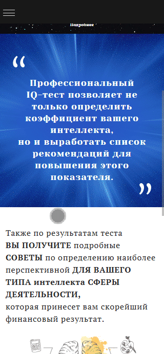
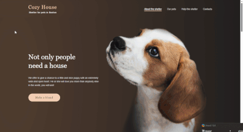
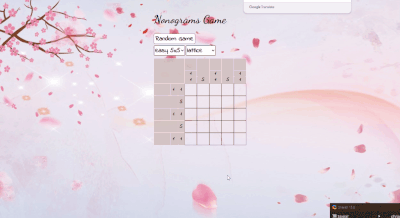
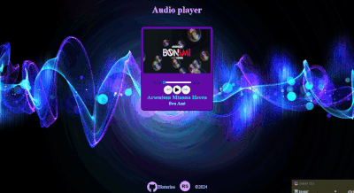
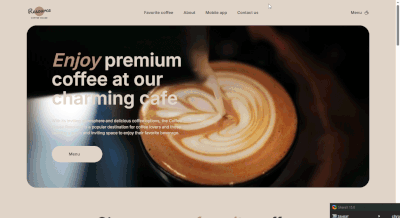
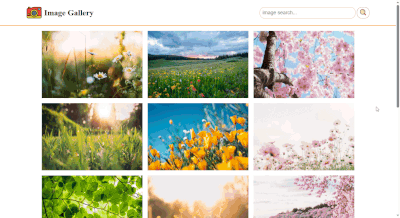
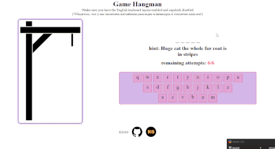

## Всем привет 👋
Я занимаюсь самостоятельным изучением программирования. Изучаю
HTML, CSS, JavaScript. Использование препроцессора (SCSS), работа с Figma.  
🌎 Проживание: Россия, Хабаровский край, г. Комсомольск-на-Амуре  
🎓 Образование: медицинский лабораторный техник (красный диплом, 2019)

## 📫 Контакты
  

## 🛠️ Мои проекты
### IQ-test (website)
  

  
**[Deploy link](https://besyashka.github.io/iq-test-layout/src/)  
[Repository link](https://github.com/besyashka/iq-test-layout)**

### Shelter (website)
  

  
**[Deploy link](https://besyashka.github.io/my-projects-rss/shelter/)  
[Repository link](https://github.com/besyashka/my-projects-rss/tree/shelter)**

### Nonograms (game)
  

  
**[Deploy link](https://besyashka.github.io/nonograms-game/nonograms/)  
[Repository link](https://github.com/besyashka/nonograms-game)**

### Audio-player
  

  
**[Deploy link](https://besyashka.github.io/my-projects-rss/audio-player/)  
[Repository link](https://github.com/besyashka/my-projects-rss/tree/audio-player)**

### Coffee-house (website)
  

  
**[Deploy link](https://besyashka.github.io/project-Coffee-house/coffee-house/)  
[Repository link](https://github.com/besyashka/project-Coffee-house)**

### Image-gallery
  

  
**[Deploy link](https://besyashka.github.io/my-projects-rss/image-gallery/)  
[Repository link](https://github.com/besyashka/my-projects-rss/tree/image-gallery)**

### Hangman (game)
  

  
**[Deploy link](https://github.com/besyashka/my-projects-rss/tree/random-game)  
[Repository link](https://besyashka.github.io/my-projects-rss/random-game/)**

### Resume

  
**[Deploy link](https://besyashka.github.io/resume/resume/)  
[Repository link](https://github.com/besyashka/resume?tab=readme-ov-file)**
